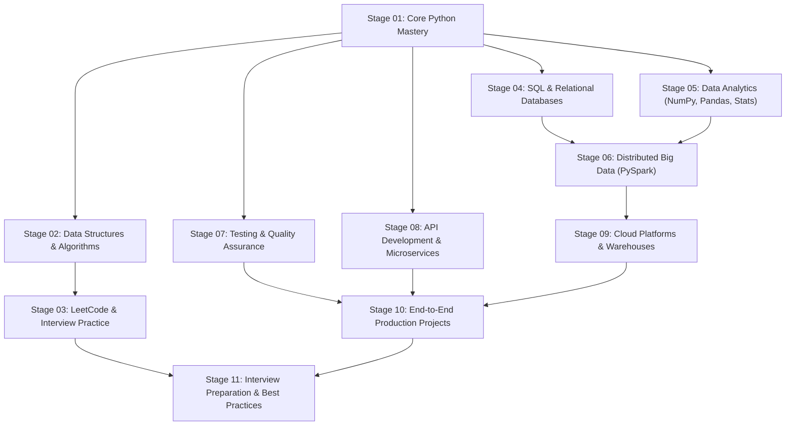

# Python Engineering Mastery: Complete Learning Path

A structured, end-to-end curriculum navigating from core language fundamentals to advanced algorithms, distributed big data systems, and production cloud microservices.

---

## Curriculum Roadmap

---

## Learning Sequence Index

| Stage | Focus Area | Path | Key Topics |
|---|---|---|---|
| **01** | **Core Python Mastery** | [`core_python/`](file:///Users/sagarshingare/Documents/python-mastery-repo/core_python) | Fundamentals, OOP, Iterators, Generators, Typing, Concurrency |
| **02** | **Data Structures & Algorithms** | [`dsa/`](file:///Users/sagarshingare/Documents/python-mastery-repo/dsa) | Arrays, Linked Lists, Trees, Graphs, DP, System Design DSA |
| **03** | **Algorithm Practice** | [`leetcode/`](file:///Users/sagarshingare/Documents/python-mastery-repo/leetcode) | Easy, Medium, and Hard LeetCode patterns & CLI runner |
| **04** | **SQL & Relational Databases** | [`sql/`](file:///Users/sagarshingare/Documents/python-mastery-repo/sql) | DDL/DML, Joins, Window Functions, CTEs, Optimization |
| **05** | **Data Analytics & Libraries** | [`numpy_lib/`](file:///Users/sagarshingare/Documents/python-mastery-repo/numpy_lib), [`pandas_lib/`](file:///Users/sagarshingare/Documents/python-mastery-repo/pandas_lib), [`statistics/`](file:///Users/sagarshingare/Documents/python-mastery-repo/statistics) | Vectorization, DataFrames, Aggregations, Hypothesis testing |
| **06** | **Distributed Big Data** | [`pyspark/`](file:///Users/sagarshingare/Documents/python-mastery-repo/pyspark) | SparkSession, RDDs, DataFrames, Transformations, Actions |
| **07** | **Testing & Quality Assurance** | [`testing/`](file:///Users/sagarshingare/Documents/python-mastery-repo/testing) | Pytest, Mocking, Integration DB Fixtures, Benchmarking |
| **08** | **API Development** | [`api_development/`](file:///Users/sagarshingare/Documents/python-mastery-repo/api_development) | FastAPI CRUD, Flask, JWT, Rate Limiting, Observability |
| **09** | **Cloud & Data Warehouses** | [`cloud/`](file:///Users/sagarshingare/Documents/python-mastery-repo/cloud) | AWS, Azure, Databricks Lakehouse, Snowflake |
| **10** | **Production Projects** | [`projects/`](file:///Users/sagarshingare/Documents/python-mastery-repo/projects) | Batch ETL Pipelines, Customer 360, Streaming |
| **11** | **Interview Prep & Docs** | [`interview_prep/`](file:///Users/sagarshingare/Documents/python-mastery-repo/interview_prep), [`docs/`](file:///Users/sagarshingare/Documents/python-mastery-repo/docs) | System design, behavioral questions, architecture cheatsheets |

---

## Detailed Curriculum Breakdown

### Stage 01: Core Python Mastery (`core_python/`)
*Master Python's language mechanics, object model, memory, and concurrency primitives.*

1. **Step 1.1 — Language Fundamentals**: [`core_python/basics/`](file:///Users/sagarshingare/Documents/python-mastery-repo/core_python/basics)
   - Variables, primitive types, control flow, functions, lambdas, scope.
2. **Step 1.2 — Object-Oriented Programming**: [`core_python/oops/`](file:///Users/sagarshingare/Documents/python-mastery-repo/core_python/oops)
   - Encapsulation, inheritance, polymorphism, abstract base classes (`abc`), descriptors protocol (`__set_name__`, data/non-data), dataclasses (`frozen`, `slots`, `kw_only`).
3. **Step 1.3 — Iteration Protocol**: [`core_python/iterators/`](file:///Users/sagarshingare/Documents/python-mastery-repo/core_python/iterators)
   - `__iter__`, `__next__`, custom iterators, iterator protocol, sentinel iterators.
4. **Step 1.4 — Generators & Streams**: [`core_python/generators/`](file:///Users/sagarshingare/Documents/python-mastery-repo/core_python/generators)
   - Lazy evaluation, `yield`, `yield from`, generator pipelines, memory efficiency.
5. **Step 1.5 — Decorators & Metaprogramming**: [`core_python/decorators/`](file:///Users/sagarshingare/Documents/python-mastery-repo/core_python/decorators)
   - Closures, function decorators, parameterized decorators, class decorators, `@wraps`.
6. **Step 1.6 — Context Managers**: [`core_python/context_managers/`](file:///Users/sagarshingare/Documents/python-mastery-repo/core_python/context_managers)
   - `__enter__` and `__exit__`, `contextlib.contextmanager`, resource safety, locking.
7. **Step 1.7 — Exception Handling**: [`core_python/exception_handling/`](file:///Users/sagarshingare/Documents/python-mastery-repo/core_python/exception_handling)
   - Exception hierarchies, custom domain exceptions, exception chaining (`from e`).
8. **Step 1.8 — Modern Static Typing**: [`core_python/typing/`](file:///Users/sagarshingare/Documents/python-mastery-repo/core_python/typing)
   - `TypeVar`, `Generic`, `Protocol`, `ParamSpec`, `@overload`, `TypedDict`, `Literal`.
9. **Step 1.9 — Advanced Design Patterns**: [`core_python/advanced_patterns/`](file:///Users/sagarshingare/Documents/python-mastery-repo/core_python/advanced_patterns)
   - Singleton, Factory, Strategy, Observer, Adapter, Dependency Injection.
10. **Step 1.10 — Metaclasses**: [`core_python/metaclasses/`](file:///Users/sagarshingare/Documents/python-mastery-repo/core_python/metaclasses)
    - `type.__new__`, class construction hooks, API enforcement, validation.
11. **Step 1.11 — Memory Management**: [`core_python/memory_management/`](file:///Users/sagarshingare/Documents/python-mastery-repo/core_python/memory_management)
    - Reference counting, cyclic garbage collection (`gc`), `__slots__`, memory profiling.
12. **Step 1.12 — Production Logging**: [`core_python/logging/`](file:///Users/sagarshingare/Documents/python-mastery-repo/core_python/logging)
    - Structured JSON logging, rotating file handlers, contextual filters.
13. **Step 1.13 — Concurrency: Multithreading**: [`core_python/multithreading/`](file:///Users/sagarshingare/Documents/python-mastery-repo/core_python/multithreading)
    - Global Interpreter Lock (GIL), `threading.Thread`, `ThreadPoolExecutor`, Locks, Queues.
14. **Step 1.14 — Concurrency: Multiprocessing**: [`core_python/multiprocessing/`](file:///Users/sagarshingare/Documents/python-mastery-repo/core_python/multiprocessing)
    - Bypassing the GIL, `ProcessPoolExecutor`, CPU-bound workloads, shared memory.
15. **Step 1.15 — Concurrency: Asynchronous I/O**: [`core_python/async_programming/`](file:///Users/sagarshingare/Documents/python-mastery-repo/core_python/async_programming)
    - `asyncio`, coroutines, event loops, tasks, `asyncio.gather`, structured concurrency (`TaskGroup`).
16. **Step 1.16 — Packaging & Distribution**: [`core_python/packaging/`](file:///Users/sagarshingare/Documents/python-mastery-repo/core_python/packaging)
    - Modern `pyproject.toml` standards, building distributions, wheels, CLI entry points.
17. **Step 1.17 — Modern Python Versions (3.8 — 3.13)**: [`core_python/python_versions/`](file:///Users/sagarshingare/Documents/python-mastery-repo/core_python/python_versions)
    - Walrus operator `:=`, structural pattern matching `match/case`, exception groups `except*`, PEP 695 type parameters, PEP 703 Free-threaded CPython (No-GIL), Tier 2 JIT compiler.

---

### Stage 02: Data Structures & Algorithms (`dsa/`)
*Build foundational algorithmic problem solving and low-level data structures.*

1. **Step 2.1 — Arrays**: [`dsa/arrays/`](file:///Users/sagarshingare/Documents/python-mastery-repo/dsa/arrays) (Two sum, two pointers, prefix sums)
2. **Step 2.2 — Strings**: [`dsa/strings/`](file:///Users/sagarshingare/Documents/python-mastery-repo/dsa/strings) (KMP pattern matching, palindromes, anagrams)
3. **Step 2.3 — Linked Lists**: [`dsa/linked_list/`](file:///Users/sagarshingare/Documents/python-mastery-repo/dsa/linked_list) (Singly, Doubly, cycle detection, reversal)
4. **Step 2.4 — Stacks**: [`dsa/stack/`](file:///Users/sagarshingare/Documents/python-mastery-repo/dsa/stack) (LIFO, MinStack, balanced parentheses, postfix)
5. **Step 2.5 — Queues**: [`dsa/queue/`](file:///Users/sagarshingare/Documents/python-mastery-repo/dsa/queue) (FIFO, CircularQueue, PriorityQueue, Deque)
6. **Step 2.6 — Recursion**: [`dsa/recursion/`](file:///Users/sagarshingare/Documents/python-mastery-repo/dsa/recursion) (Divide-and-conquer, power sets, Hanoi, permutations)
7. **Step 2.7 — Sliding Window**: [`dsa/sliding_window/`](file:///Users/sagarshingare/Documents/python-mastery-repo/dsa/sliding_window) (Max sum subarray, distinct window substrings)
8. **Step 2.8 — Trees**: [`dsa/trees/`](file:///Users/sagarshingare/Documents/python-mastery-repo/dsa/trees) (Binary Search Trees, traversals, height, balance)
9. **Step 2.9 — Heaps & Priority**: [`dsa/heaps/`](file:///Users/sagarshingare/Documents/python-mastery-repo/dsa/heaps) (MinHeap, MaxHeap, heapsort, top-K, stream median)
10. **Step 2.10 — Graphs**: [`dsa/graphs/`](file:///Users/sagarshingare/Documents/python-mastery-repo/dsa/graphs) (BFS, DFS, topological sorting, cycle detection)
11. **Step 2.11 — Backtracking**: [`dsa/backtracking/`](file:///Users/sagarshingare/Documents/python-mastery-repo/dsa/backtracking) (N-Queens, Sudoku, subset sum, word search)
12. **Step 2.12 — Dynamic Programming**: [`dsa/dynamic_programming/`](file:///Users/sagarshingare/Documents/python-mastery-repo/dsa/dynamic_programming) (Knapsack, LCS, edit distance, coin change)
13. **Step 2.13 — System Design DSA**: [`dsa/system_design/`](file:///Users/sagarshingare/Documents/python-mastery-repo/dsa/system_design) (LRU Cache, Trie autocomplete, Bloom Filter)

---

### Stage 03: LeetCode & Interview Practice (`leetcode/`)
*Apply data structures to competitive programming and technical interviews.*

1. **Step 3.1 — Easy Problems**: [`leetcode/easy/`](file:///Users/sagarshingare/Documents/python-mastery-repo/leetcode/easy)
2. **Step 3.2 — Medium Problems**: [`leetcode/medium/`](file:///Users/sagarshingare/Documents/python-mastery-repo/leetcode/medium)
3. **Step 3.3 — Hard Problems**: [`leetcode/hard/`](file:///Users/sagarshingare/Documents/python-mastery-repo/leetcode/hard)
4. **Step 3.4 — Company-Wise Tracks**: [`leetcode/company_wise/`](file:///Users/sagarshingare/Documents/python-mastery-repo/leetcode/company_wise) (Google, Meta, Amazon, Microsoft)
5. **Step 3.5 — Problem Runner CLI**: Run `python -m leetcode.run_problems list` or `python -m leetcode.examples`

---

### Stage 04: SQL & Relational Databases (`sql/`)
*Master data extraction, window analytical queries, and query performance tuning.*

1. **Step 4.1 — SQL Fundamentals**: [`sql/basics/`](file:///Users/sagarshingare/Documents/python-mastery-repo/sql/basics) (DDL, DML, filtering, aggregation, GROUP BY/HAVING)
2. **Step 4.2 — Join Patterns**: [`sql/joins/`](file:///Users/sagarshingare/Documents/python-mastery-repo/sql/joins) (INNER, LEFT, RIGHT, FULL, CROSS, SELF, anti-joins)
3. **Step 4.3 — Common Table Expressions**: [`sql/cte/`](file:///Users/sagarshingare/Documents/python-mastery-repo/sql/cte) (Modular WITH, recursive org charts, series generation)
4. **Step 4.4 — Window Functions**: [`sql/window_functions/`](file:///Users/sagarshingare/Documents/python-mastery-repo/sql/window_functions) (ROW_NUMBER, DENSE_RANK, LAG/LEAD, cumulative sum)
5. **Step 4.5 — Advanced Queries**: [`sql/advanced_queries/`](file:///Users/sagarshingare/Documents/python-mastery-repo/sql/advanced_queries) (Conditional pivot, unpivoting, upserts, JSON queries)
6. **Step 4.6 — Query Optimization**: [`sql/optimization/`](file:///Users/sagarshingare/Documents/python-mastery-repo/sql/optimization) (EXPLAIN QUERY PLAN, composite B-Tree indexes, sargability)
7. **Step 4.7 — Live Execution**: Run `python -m sql.run_examples`

---

### Stage 05: Data Analytics & Scientific Libraries (`numpy_lib/`, `pandas_lib/`, `statistics/`)
*Numerical computing, tabular data manipulation, statistical inference, and memory optimization.*

1. **Step 5.1 — NumPy Fundamentals**: [`numpy_lib/`](file:///Users/sagarshingare/Documents/python-mastery-repo/numpy_lib)
   - [`numpy_lib/arrays/`](file:///Users/sagarshingare/Documents/python-mastery-repo/numpy_lib/arrays) (N-d grids, strided slicing, reshaping, stacking, matrix metrics)
   - [`numpy_lib/broadcasting/`](file:///Users/sagarshingare/Documents/python-mastery-repo/numpy_lib/broadcasting) (Dimension expansion, feature standardization, pairwise Euclidean distance)
   - [`numpy_lib/vectorization/`](file:///Users/sagarshingare/Documents/python-mastery-repo/numpy_lib/vectorization) (Ufuncs, conditional `np.select`, drawdown, loop speedup benchmarks)
   - [`numpy_lib/optimization/`](file:///Users/sagarshingare/Documents/python-mastery-repo/numpy_lib/optimization) (C/Fortran layout, in-place `out=`, view vs copy, numeric dtype downcasting)
   - *Master Runner*: `python3 -m numpy_lib.run_examples --submodule all`
2. **Step 5.2 — Pandas Tabular Data**: [`pandas_lib/`](file:///Users/sagarshingare/Documents/python-mastery-repo/pandas_lib)
   - [`pandas_lib/basics/`](file:///Users/sagarshingare/Documents/python-mastery-repo/pandas_lib/basics) (Dataframe ingestion, cleaning, missing value imputation, datetime feature extraction)
   - [`pandas_lib/groupby/`](file:///Users/sagarshingare/Documents/python-mastery-repo/pandas_lib/groupby) (Named aggregations, group z-score transforms, percentage of total, pivot tables)
   - [`pandas_lib/joins/`](file:///Users/sagarshingare/Documents/python-mastery-repo/pandas_lib/joins) (Relational merges, index joins, concatenation, time-series `merge_asof`)
   - [`pandas_lib/window_functions/`](file:///Users/sagarshingare/Documents/python-mastery-repo/pandas_lib/window_functions) (Rolling metrics, expanding cumulative sums, EWMA, partitioned ranking)
   - [`pandas_lib/optimization/`](file:///Users/sagarshingare/Documents/python-mastery-repo/pandas_lib/optimization) (Dtype downcasting, categorical compression, chunked streaming, apply vs vectorization)
   - *Master Runner*: `python3 -m pandas_lib.run_examples --submodule all`
3. **Step 5.3 — Statistical Analysis**: [`statistics/`](file:///Users/sagarshingare/Documents/python-mastery-repo/statistics)
   - [`statistics/descriptive/`](file:///Users/sagarshingare/Documents/python-mastery-repo/statistics/descriptive) (Central tendency, dispersion, Tukey IQR outlier detection, Pearson/Spearman correlation)
   - [`statistics/distributions/`](file:///Users/sagarshingare/Documents/python-mastery-repo/statistics/distributions) (Normal empirical rule, Binomial, Poisson, Exponential, KS normality tests)
   - [`statistics/hypothesis_testing/`](file:///Users/sagarshingare/Documents/python-mastery-repo/statistics/hypothesis_testing) (One-sample t, Welch's two-sample t, paired t, ANOVA, Chi-Square, Mann-Whitney)
   - [`statistics/regression/`](file:///Users/sagarshingare/Documents/python-mastery-repo/statistics/regression) (Simple linear regression, multiple OLS linear regression, R², RMSE, out-of-sample prediction)
   - *Master Runner*: `python3 -m statistics.run_examples --submodule all`

---

### Stage 06: Distributed Big Data (`pyspark/`)
*Scale data engineering pipelines to multi-node clusters with Apache Spark.*

1. **Step 6.1 — Spark Basics**: [`pyspark/basics/`](file:///Users/sagarshingare/Documents/python-mastery-repo/pyspark/basics) (SparkSession lifecycle, `StructType` schemas, DataFrame ingestion, metadata inspection, filtering)
2. **Step 6.2 — Transformations**: [`pyspark/transformations/`](file:///Users/sagarshingare/Documents/python-mastery-repo/pyspark/transformations) (Narrow vs wide transformations, groupBy aggregations, Broadcast Hash Joins, window analytics)
3. **Step 6.3 — Actions & Sinks**: [`pyspark/actions/`](file:///Users/sagarshingare/Documents/python-mastery-repo/pyspark/actions) (Collect, take, count, summary statistics, Parquet/CSV/JSON writes, partitioned directory layouts)
4. **Step 6.4 — Spark Interview Prep & Lakehouse Tradeoffs**: [`pyspark/interview_questions/`](file:///Users/sagarshingare/Documents/python-mastery-repo/pyspark/interview_questions) (Catalyst optimizer, shuffle internals, partition tuning, Lakehouse table formats: Apache Iceberg vs Delta Lake vs Apache Hudi, file formats: Parquet vs ORC vs Avro, coding problems)
5. *Master Runner*: `python3 -m pyspark.run_examples --submodule all`

---

### Stage 07: Testing & Quality Assurance (`testing/`)
*Write resilient unit tests, mock external I/O, isolate databases, and benchmark performance.*

1. **Step 7.1 — Unit Testing with Pytest**: [`testing/pytest/`](file:///Users/sagarshingare/Documents/python-mastery-repo/testing/pytest) (Fixtures, assertions, parameterized tests)
2. **Step 7.2 — Mocking & Isolation**: [`testing/mocking/`](file:///Users/sagarshingare/Documents/python-mastery-repo/testing/mocking) (MagicMock, patch, side_effects, autospec, AsyncMock)
3. **Step 7.3 — Integration Testing**: [`testing/integration_testing/`](file:///Users/sagarshingare/Documents/python-mastery-repo/testing/integration_testing) (SQLite fixtures, transactional scope rollback)
4. **Step 7.4 — Performance Testing**: [`testing/performance_testing/`](file:///Users/sagarshingare/Documents/python-mastery-repo/testing/performance_testing) (Micro-benchmarks, percentiles, tracemalloc profiling)
5. **Step 7.5 — Live Demonstrations**: Run `python -m testing.run_examples`

---

### Stage 08: API Development & Microservices (`api_development/`)
*Design and deploy production-grade HTTP REST services.*

1. **Step 8.1 — Authentication & RBAC**: [`api_development/authentication/`](file:///Users/sagarshingare/Documents/python-mastery-repo/api_development/authentication) (PBKDF2 hashing, API keys, role enforcement)
2. **Step 8.2 — JSON Web Tokens**: [`api_development/jwt/`](file:///Users/sagarshingare/Documents/python-mastery-repo/api_development/jwt) (RFC 7519 HMAC-SHA256 encoding, signature validation)
3. **Step 8.3 — Rate Limiting**: [`api_development/rate_limiting/`](file:///Users/sagarshingare/Documents/python-mastery-repo/api_development/rate_limiting) (Token Bucket, Sliding Window algorithms)
4. **Step 8.4 — FastAPI CRUD**: [`api_development/fastapi/`](file:///Users/sagarshingare/Documents/python-mastery-repo/api_development/fastapi) (Pydantic v2 schemas, dependency injection, pagination)
5. **Step 8.5 — Flask Framework**: [`api_development/flask/`](file:///Users/sagarshingare/Documents/python-mastery-repo/api_development/flask) (Application factories, blueprints, JSON error handlers)
6. **Step 8.6 — Production Observability**: [`api_development/production_api/`](file:///Users/sagarshingare/Documents/python-mastery-repo/api_development/production_api) (Correlation IDs, timing, RFC 7807, health checks)
7. **Step 8.7 — Live Demonstrations**: Run `python -m api_development.run_examples`

---

### Stage 09: Cloud Platforms & Warehouses (`cloud/`)
*Architect modern cloud data platforms and distributed analytical data warehouses.*

1. **Step 9.1 — AWS Ecosystem**: [`cloud/aws/`](file:///Users/sagarshingare/Documents/python-mastery-repo/cloud/aws) (S3, Glue, Athena, Lambda)
2. **Step 9.2 — Azure Ecosystem**: [`cloud/azure/`](file:///Users/sagarshingare/Documents/python-mastery-repo/cloud/azure) (ADLS Gen2, Synapse, Data Factory)
3. **Step 9.3 — Databricks Lakehouse**: [`cloud/databricks/`](file:///Users/sagarshingare/Documents/python-mastery-repo/cloud/databricks) (Unity Catalog, Delta Lake, Delta Live Tables)
4. **Step 9.4 — Snowflake Data Cloud**: [`cloud/snowflake/`](file:///Users/sagarshingare/Documents/python-mastery-repo/cloud/snowflake) (Virtual warehouses, zero-copy cloning, clustering)

---

### Stage 10: End-to-End Production Projects (`projects/`)
*Build real-world multi-step batch and streaming data pipelines.*

1. **Step 10.1 — Batch ETL Pipeline**: [`projects/batch_etl_pipeline/`](file:///Users/sagarshingare/Documents/python-mastery-repo/projects/batch_etl_pipeline) (Extract, validate, transform, load, logging)
2. **Step 10.2 — Customer 360 Pipeline**: [`projects/customer_360/`](file:///Users/sagarshingare/Documents/python-mastery-repo/projects/customer_360) (Data modeling, enrichment, entity resolution)
3. **Step 10.3 — Streaming Pipeline**: [`projects/streaming_pipeline/`](file:///Users/sagarshingare/Documents/python-mastery-repo/projects/streaming_pipeline) (Event stream ingestion, micro-batching)

---

### Stage 11: Interview Preparation & Documentation (`interview_prep/`, `docs/`)
*Consolidate knowledge for senior and staff engineering interview rounds.*

1. **Step 11.1 — Technical & Behavioral Prep**: [`interview_prep/`](file:///Users/sagarshingare/Documents/python-mastery-repo/interview_prep)
2. **Step 11.2 — Architecture Guides**: [`docs/architecture/`](file:///Users/sagarshingare/Documents/python-mastery-repo/docs/architecture)
3. **Step 11.3 — Engineering Best Practices**: [`docs/best_practices/`](file:///Users/sagarshingare/Documents/python-mastery-repo/docs/best_practices)
4. **Step 11.4 — Cheat Sheets**: [`docs/cheatsheets/`](file:///Users/sagarshingare/Documents/python-mastery-repo/docs/cheatsheets)
5. **Step 11.5 — Interview Notes**: [`docs/interview_notes/`](file:///Users/sagarshingare/Documents/python-mastery-repo/docs/interview_notes)
