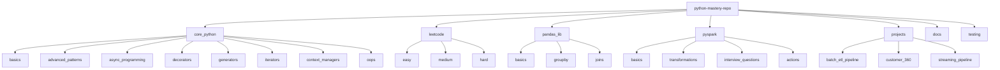

# Repository Architecture

This diagram describes the main package structure, core modules, and training paths in the repo.

## Hierarchy View

## Memory DAG / UI-level map

- `core_python/` contains language fundamentals, advanced patterns, and runtime concepts.
- `leetcode/` contains algorithm practice grouped by difficulty.
- `pandas_lib/` contains pandas exercises and example helpers, isolated from the installed `pandas` package.
- `pyspark/` contains Spark examples for basics, transformations, actions, and interview prep.
- `projects/` contains full sample pipelines and production-style data engineering projects.
- `docs/` contains diagrams, architecture guidance, and interview notes.
- `testing/` contains pytest-based validation of the repository.

## Usage guidance

Use standardized entry files in training modules:

- `python -m core_python.basics.examples`
- `python -m pyspark.basics.examples`
- `python -m core_python.oops.examples`

And use the LeetCode runner directly:

- `python -m leetcode.run_problems list`
